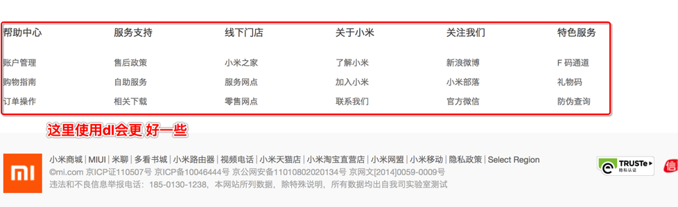

```
学习目标:

  - 了解常用浏览器
  - 掌握WEB标准
  - 理解标签语义化
  - 掌握常用的排版标签
  - 掌握常用的文本格式化图像链接等标签
  - 掌握三种列表标签
  - 掌握表格标签
  - 掌握表格标签
  - 掌握表单标签
  - 掌握H5新增表单和表单属性
```

# 写在学习前

## 认识操作系统

操作系统（Operating System）简称OS，是管理和控制计算机硬件与软件资源的计算机程序，是直接运行在“裸机”上的最基本的操作系统，任何其他软件都必须要在操作系统的支持下才能运行。

常见的操作系统有：

indows操作系统（Windows95/98/2000/xp/vista/7/8/10）等

Unix操作系统

Linux操作系统

## 认识网页

```
网页主要由文字、图像和超链接等元素构成。当然，
除了这些元素，网页中还可以包含音频、视频以及Flash等。
```


```
思考：  网页是如何形成的呢?
```


## 认识浏览器

### 什么是浏览器

浏览器就是一个运行在操作系统上的普通应用程序，和QQ、酷狗音乐等没有本质的区别。浏览器的作用是向服务器发送网络请求，并将从服务器上获取到数据显示出来。

### 常见浏览器

浏览器是网页运行的平台，常用的浏览器有IE、火狐（Firefox）、谷歌（Chrome）、Safari和Opera等。我们平时称为五大浏览器。


各浏览器占有的市场份额：

查看网站： <a href="http://tongji.baidu.com/data/browser" target="_blank">http://tongji.baidu.com/data/browser</a>


### 浏览器的内核

浏览器内核又可以分成两部分：<font color="red">渲染引擎</font>(layout engineer 或者 Rendering Engine)和 <font color="red">JS 引擎</font>。

> 渲染引擎 它负责取得网页的内容（HTML、XML、图像等等）、整理讯息（例如加入 CSS 等），以及计算网页的显示方式，然后会输出至显示器或打印机。浏览器的内核的不同对于网页的语法解释会有不同，所以渲染的效果也不相同。

> JS 引擎 则是解析 Javascript 语言，执行 javascript语言来实现网页的动态效果。

> 最开始渲染引擎和 JS 引擎并没有区分的很明确，后来 JS 引擎越来越独立，内核就倾向于只指渲染引擎。有一个网页标准计划小组制作了一个 ACID 来测试引擎的兼容性和性能。内核的种类很多，如加上没什么人使用的非商业的免费内核，可能会有10多种，但是常见的浏览器内核可以分这四种：**Trident、Gecko、Blink、Webkit**。


（1）Trident(IE内核) 

国内很多的双核浏览器的其中一核便是 Trident，美其名曰 "兼容模式"。

代表： IE、傲游、世界之窗浏览器、Avant、腾讯TT、猎豹安全浏览器、360极速浏览器、百度浏览器等。

Window10 发布后，IE 将其内置浏览器命名为 Edge，Edge 最显著的特点就是新内核 EdgeHTML。

（2）Gecko(firefox) 

Gecko(Firefox 内核)： Mozilla FireFox(火狐浏览器) 采用该内核，Gecko 的特点是代码完全公开，因此，其可开发程度很高，全世界的程序员都可以为其编写代码，增加功能。 可惜这几年已经没落了， 比如 打开速度慢、升级频繁、猪一样的队友flash、神一样的对手chrome。

（3） webkit(Safari)  

 Safari 是苹果公司开发的浏览器，所用浏览器内核的名称是大名鼎鼎的 WebKit。

 现在很多人错误地把 webkit 叫做 chrome内核（即使 chrome内核已经是 blink 了），苹果感觉像被别人抢了媳妇，都哭晕再厕所里面了。

 代表浏览器：傲游浏览器3、 Apple Safari (Win/Mac/iPhone/iPad)、Symbian手机浏览器、Android 默认浏览器，

（4） Chromium/Bink(chrome) 

   在 Chromium 项目中研发 Blink 渲染引擎（即浏览器核心），内置于 Chrome 浏览器之中。Blink 其实是 WebKit 的分支。 

​     大部分国产浏览器最新版都采用Blink内核。

（5） Presto(Opera) 

  Presto 是挪威产浏览器 opera 的 "前任" 内核，为何说是 "前任"，因为最新的 opera 浏览器早已将之抛弃从而投入到了谷歌怀抱了。


````
了解一点
````

移动端的浏览器内核主要说的是系统内置浏览器的内核。

目前移动设备浏览器上常用的内核有 Webkit，Blink，Trident，Gecko 等，其中 iPhone 和 iPad 等苹果 iOS 平台主要是 WebKit，Android 4.4 之前的 Android 系统浏览器内核是 WebKit，Android4.4 系统浏览器切换到了Chromium，内核是 Webkit 的分支 Blink，Windows Phone 8 系统浏览器内核是 Trident。


## Web标准（重点了解）

### web标准的意义

浏览器的内核不同，他们工作原理、解析肯定不同，显示就会有差别。为了让同一个网页在不同的浏览器上都显示同样的效果，就必须要制定相应的标准。


### Web 标准构成

 Web标准不是某一个标准，而是由W3C和其他标准化组织制定的一系列标准的集合。主要包括结构（Structure）、表现（Presentation）和行为（Behavior）三个方面。

```
结构标准：结构用于对网页元素进行整理和分类，主要包括XML和XHTML两个部分。
样式标准：表现用于设置网页元素的版式、颜色、大小等外观样式，主要指的是CSS。
行为标准：行为是指网页模型的定义及交互的编写，主要包括DOM和ECMAScript两个部分
```

### Web 标准的好处

*1*、让Web的发展前景更广阔 
*2*、内容能被更广泛的设备访问
*3*、更容易被搜寻引擎搜索
*4*、降低网站流量费用
*5*、使网站更易于维护
*6*、提高页面浏览速度

# HTML初识

## 什么是HTML

​	html(HyperText Markup Language)又叫超文本标记语言，通过<font color="red">HTML标签</font>对网页中的文字、图片、视频等进行描述，进而显示网页界面。

## HTML语言特点

1. 简易性：超级文本标记语言版本升级采用超集方式，从而更加灵活方便。
2. 可扩展性：超级文本标记语言的广泛应用带来了加强功能，增加标识符等要求，超级文本标记语言采取子类元素的方式，为系统扩展带来保证。
3. 平台无关性：虽然个人计算机大行其道，但使用MAC]等其他机器的大有人在，超级文本标记语言可以使用在广泛的平台上。
4. 通用性：HTML是网络的通用语言,一种简单、通用的全置标记语言。它允许网页制作人建立文本与图片相结合的复杂页面，这些页面可以被网上任何其他人浏览到，无论使用的是什么类型的电脑或浏览器。

## HTML语言历史


## HTML的结构（重点）


就像我们生活中的书信一样，HTML代码在编写时，也需要遵循一定的规范。

````HTML
<html>   
    <head>     
        <title></title>
    </head>
    <body>
    </body>
</html>
````

课堂练习：书写我们的第一个HTML 页面！

1. 新建一个demo 的 txt 文件。
2. 里面写入刚才的HTML 骨架。
3. 把后缀名改为 .html。
4. 右击--谷歌浏览器打开。

```
1 HTML标签：

HTML文档的根标签，其它所有的标签都是html标签的子标签。

2 head标签：

作用：用于定义文档的头部，一般用来申明使用的脚本语言以及网页传输时使用的方式等。通常会在head标签里添加下面的几个子标签：

title,meta,base,style,script,link

注意在head标签中我们必须要设置的标签是title

3.title标签：

作用：让页面拥有一个属于自己的标题，title标签里的内容会显示到浏览器的选项卡上。

4.body标签：

作用：页面的主体部分，用于存放界面上显示的所有内容，可以包含文本、图片、音频、视频等各种内容！
```

## 注释标签

在HTML中还有一种特殊的标签——注释标签。如果需要在HTML文档中添加一些便于阅读和理解但又不需要显示在页面中的注释文字，就需要使用注释标签。其基本语法格式如下：
​        

```html
    <!-- 注释语句 -->
```

注释内容不会显示在浏览器窗口中，但是作为HTML文档内容的一部分，也会被下载到用户的计算机上，查看源代码时就可以看到。

注释重要性：


## HTML标签分类

 在HTML页面中，带有“< >”符号的元素被称为HTML标签，如上面提到的 &lt;HTML&gt;、&lt;head&gt;、&lt;body&gt;都是HTML标签。所谓标签就是放在“< >” 标签符中表示某个功能的编码命令，也称为HTML标签或 HTML元素。

1.双标签

```html
<标签名> 内容 </标签名>
```

该语法中“<标签名>”表示该标签的作用开始，一般称为“开始标签（start tag）”，“</标签名>” 表示该标签的作用结束，一般称为“结束标签（end tag）”。和开始标签相比，结束标签只是在前面加了一个关闭符“/”。

> ```html
> 比如 <body>我是文字  </body>
> ```

2.单标签

```html
<标签名 />
```

  单标签也称空标签，是指用一个标签符号即可完整地描述某个功能的标签。

> ```html
> 比如  <br />
> ```


## HTML标签关系

HTML的标签关系一共分为两种，即嵌套关系（也叫父子关系）和并列关系（也叫兄弟关系）。

1. 嵌套关系

   ```html
   <head><title></title></head>
   ```

   这里的head标签和title标签就属于是父子关系。

2. 并列关系

   ```html
   <head></head><body></body>
   ```

   这里的head标签和body标签就属于是并列关系。

   ​

   倡议： 如果两个标签之间的关系是嵌套关系，子元素最好缩进一个tab键的身位。如果是并列关系，最好上下对齐。

   ```html
   <head>
     <title></title>
   </head>
   <body>
   </body>
   ```

## 开发工具


## 文档类型（了解）

````html
<!DOCTYPE html>
````

这句话就是告诉浏览器我们编写的代码使用的是哪个版本的HTML规范。

<!DOCTYPE> 标签位于文档的最前面，用于向浏览器说明当前文档使用哪种 HTML 或 XHTML 标准规范，必需在开头处使用<!DOCTYPE>标签为所有的XHTML文档指定XHTML版本和类型，只有这样浏览器才能按指定的文档类型进行解析。

常见的文档类型有：

|         HTML版本         |                对应的文档类型声明                 |
| :--------------------: | :--------------------------------------: |
|         HTML5          |             <!DOCTYPE html>              |
|    HTML 4.01 Strict    | <!DOCTYPE HTML PUBLIC "-//W3C//DTD HTML 4.01//EN" "http://www.w3.org/TR/html4/strict.dtd"> |
| HTML 4.01 Transitional | <!DOCTYPE HTML PUBLIC "-//W3C//DTD HTML 4.01 Transitional//EN" "http://www.w3.org/TR/html4/loose.dtd"> |
|   HTML 4.01 Frameset   | <!DOCTYPE HTML PUBLIC "-//W3C//DTD HTML 4.01 Frameset//EN" "http://www.w3.org/TR/html4/frameset.dtd"> |
|    XHTML 1.0 Strict    | <!DOCTYPE html PUBLIC "-//W3C//DTD XHTML 1.0 Strict//EN" "http://www.w3.org/TR/xhtml1/DTD/xhtml1-strict.dtd"> |
| XHTML 1.0 Transitional | <!DOCTYPE html PUBLIC "-//W3C//DTD XHTML 1.0 Transitional//EN" "http://www.w3.org/TR/xhtml1/DTD/xhtml1-transitional.dtd"> |
|          … …           |                   … …                    |

数据来源：http://www.w3school.com.cn/tags/tag_doctype.asp

## 字符集

<meta charset="UTF-8">

utf-8是目前最常用的字符集编码方式，常用的字符集编码方式还有gbk和gb2312。

gb2312 简单中文  包括6763个汉字

BIG5   繁体中文 港澳台等用

GBK包含全部中文字符    是GB2312的扩展，加入对繁体字的支持，兼容GB2312

UTF-8则包含全世界所有国家需要用到的字符

```
记住一点，以后我们统统使用UTF-8 字符集, 这样就避免出现字符集不统一而引起乱码的情况了。
```

# HTML标签的语义化

白话： 所谓标签语义化，就是指标签的含义。

## 为什么要有语义化标签

1. 方便代码的阅读和维护
2. 同时让浏览器或是网络爬虫可以很好地解析，从而更好分析其中的内容 
3. 使用语义化标签会具有更好地搜索引擎优化 

核心：在合适的地方使用合理的标签。

语义是否良好： 当我们去掉CSS之后，网页结构依然组织有序，并且有良好的可读性。

不管是谁都能看懂这块内容是什么。

遵循的原则：先确定语义的HTML ，再选合适的CSS。

# HTML标签（重点）

标签是以尖括号”<>”包裹的，在HTML里代表特殊的含义，比如&lt;html&gt;、&lt;head&gt;、&lt;title&gt;等都属于标签。标签是html语言的基础，一个html文件可以说是由无数个标签组成的。


## 书写规范

1. 一个标准的HTML文件，必须要有完整的结构，包括文档类型声明、html标签、head标签、body标签。在head标签里，需要添加title标签以及指定文件的字符编码。
2. 标签与属性都需要使用小写字母。
3. 所有的标签都要进行合理的嵌套。
4. 标签通常是成对出现的，要注意标签的关闭。

## 排版标签

排版标签主要和css搭配使用，显示网页结构的标签，是网页布局最常用的标签。

### 标题标签（熟记）

为了使网页更具有语义化，我们经常会在页面中用到标题标签，HTML提供了6个等级的标题，即

 `<h1>、<h2>、<h3>、<h4>、<h5>和<h6>`

```
标题标签语义：  作为标题使用，并且依据重要性递减
```

其基本语法格式如下：

```html
<hn>标题文本</hn>
```

> 注意：  h1 标签因为重要，尽量少用，一般h1 都是给logo使用。

### 段落标签(熟记)

单词缩写：  paragraph  段落

 在网页中要把文字有条理地显示出来，离不开段落标签，就如同我们平常写文章一样，整个网页也可以分为若干个段落，而段落的标签就是

```html
<p>  文本内容  </p>
```

p标签是HTML文档中最常见的标签之一，默认情况下，文本在一个段落中会根据浏览器窗口的大小自动换行，而且段落在上下会有默认间距。

### 水平线标签(认识)

单词缩写：  horizontal  横线

在网页中常常看到一些水平线将段落与段落之间隔开，使得文档结构清晰，层次分明。这些水平线可以通过插入图片实现，也可以简单地通过标签来完成，<hr />就是创建横跨网页水平线的标签。其基本语法格式如下：

```html
<hr />是单标签
```

 在网页中显示默认样式的水平线。

课堂练习：新闻界面


### div和span标签(重点)

div和span是两个没有语义的标签，它们的作用是用来做网页布局。在当前阶段，大家只需要记住这两个标签即可，在后续学习CSS对页面进行布局时，会大量的使用到这两个标签。

### 换行标签(熟记)

在HTML中，一个段落中的文字会从左到右依次排列，直到浏览器窗口的右端，然后自动换行。如果希望某段文本强制换行显示，就需要使用换行标签。

```html
<br />
```

在HTML里，一个回车或者多个空格在浏览器里显示时，会被解析成为一个空格字符。

### 特殊字符(理解)

HTML里存在一些特殊字符，在书写时需要通过代码来替代。


HTML特殊字符：http://www.w3school.com.cn/tags/html_ref_entities.html

## 文本格式化标签(熟记)

在网页中，有时需要为文字设置粗体、斜体或下划线效果，这时就需要用到HTML中的文本格式化标签，使文字以特殊的方式显示。


buis是没有语义的标签，它们的作用只是为了让文字区别显示； 而strong、em、del、ins标签却却有着各自对应的语义。

## 标签属性

属性指的就特性，比如说对于一部手机来说，会有品牌，颜色，尺寸等特性。

标签属性，指的就是标签的特性。使用HTML制作网页时，如果想让HTML标签提供更多的信息，可以使用HTML标签的属性加以设置。其基本语法格式如下：

```html
<标签名 属性1="属性值1" 属性2="属性值2" …> 内容 </标签名>
```

语法的注意事项：

1.标签可以拥有多个属性，必须写在开始标签中，位于标签名后面。

2.属性之间不分先后顺序，标签名与属性、属性与属性之间均以空格分开。

3.任何标签的属性都有默认值，省略该属性则取默认值。

采取  **键值对** 的格式   key="value"  的格式  

比如:

```
<hr width="400" />
```

  有一个hr标签，它的属性名是宽度，属性值是400，也就是说将一个hr分割线的宽度设置成了400.

建议：<font color="red">不要通过属性来给标签设置样式。</font>

## 图像标签(重点)

HTML网页中任何元素的实现都要依靠HTML标签，要想在网页中显示图像就需要使用图像标签，接下来将详细介绍图像标签&lt;img /&gt;以及和他相关的属性。

img标签的基本用法如下:

```HTML

```

在该用法中，**src属性是img标签必需的属性**，用来指定加载的图片的路径。

img标签的部分常见属性如下：

|  属性名   |         属性含义         |  属性值   |
| :----: | :------------------: | :----: |
|  src   |       设置图形的路径        |  url   |
|  alt   |   当图片不能加载时，显示的替代文字   | 任意文本文字 |
| title  |    当鼠标悬停在图片时的显示文字    | 任意文本文字 |
| width  | 图片的宽度（不建议使用，请用CSS替代） |  像素值   |
| height | 图片的高度（不建议使用，请用CSS替代） |  像素值   |
| border | 图片的边框（不建议使用，请用CSS替代） |  像素值   |

### 路径的使用(重点、难点)


在实际工作中，我们通常会穿件一个文件夹专门用于存放图片文件，这时再插入图像，就需要采用“路径”的方式来指定图像文件的位置。

路径又可以分为两种：绝对路径和相对路径。

1.绝对路径

绝对路径通常是从电脑的盘符开始。

例如："C:\Users\Chris\Desktop\test.html"


一个完整的网络地址也可以称作是绝对路径。

例如：https://www.baidu.com/index.html


<font color="red">2.相对路径</font>

相对路径指的是目标文件相对于当前文件所在的文件夹的相对位置。

1. 图像文件和HTML文件位于同一文件夹：只需输入图像文件的名称即可，如&lt;img src="logo.gif" /&gt;。
2. 图像文件位于HTML文件的下一级文件夹：输入文件夹名和文件名，之间用“/”隔开，如&lt;img src="img/img01/logo.gif" /&gt;。
3. 图像文件位于HTML文件的上一级文件夹：在文件名之前加入“../” ，如果是上两级，则需要使用 “../ ../”，以此类推，如&lt;img src="../logo.gif" /&gt;。

## 超链接(重点)

在HTML中创建超链接非常简单，只需用标签环绕需要被链接的对象即可，其基本语法格式如下：

```html
<a href="跳转目标" target="目标窗口的弹出方式">文本或图像</a>
```

注意：

1.外部链接 需要添加 http://

2.内部链接 直接链接内部页面名称即可 比如 < a href="index.html"> 首页 </a >

3.如果当时没有确定链接目标时，通常将链接标签的href属性值定义为“#”(即href="#")，表示该链接暂时为一个空链接。

4.不仅可以创建文本超链接，在网页中各种网页元素，如图像、表格、音频、视频等都可以添加超链接。

### 超链接常见属性

|  属性名   |                   含义                    |                  属性值                  |
| :----: | :-------------------------------------: | :-----------------------------------: |
|  href  | 指定链接目标的url地址，当给a标签指定了href属性时，它就具有了超链的功能 |                 url路径                 |
| target |               指定链接页面的打开方式               | _self:在当前选项卡打开；<br>_blank:在新的选项卡打开超链接 |

### 锚点定位(难点)

通过创建锚点链接，用户能够快速定位到目标内容。
创建锚点链接分为两步：

```html
1.给目标内容设置id属性。
2.使用<“a href=”#id名>链接文本</a>创建链接文本。
```

### 超链接实现下载(了解)

当a标签的href属性指向的链接文件能够使用浏览器打开时，点击超链接会直接打开链接文件；但是当浏览器无法打开链接文件时，浏览器就会把这个文件给下载下来。

```	HTML
<a href="images/1.png">点我打开图片</a>
<a href="text.zip">点我现在zip文件</a>
```

## base标签(了解)

base标签是一个单标签，它为页面上的所有链接规定默认地址或默认目标，必须要位于head标签的内部。

```html
<head>
  <title></title>
  <base target="_blank"/>
</head>
```

### base标签的常见属性

|  属性名   |             含义             |       属性值       |
| :----: | :------------------------: | :-------------: |
| target |      设置页面上所有链接的默认打开方式      | _self<br>_blank |
|  href  | 给页面上的相对URL添加一个基准URL(不建议使用) |       url       |

## 列表标签

列表标签是以列表的形式显示文字或者图片，最大的特点是整齐有序。

常见列表主要分为三种：无序列表、有序列表和自定义列表。

### 无序列表(重点)

无序列表的各个列表项之间没有顺序级别之分，是并列的。其基本语法格式如下：

```HTML
<ul>
  <li>列表项1</li>
  <li>列表项2</li>
  <li>列表项3</li>
  ... ... 
</ul>
```

> tips:可以给ul设置type属性，来改变项目符号的类型，但是不建议使用。

注意事项：

```
 1. <ul></ul>中只能嵌套<li></li>，直接在<ul></ul>标签中输入其他标签或者文字的做法是不被允许的。
 2. <li>与</li>之间相当于一个容器，可以容纳所有元素。
 3. 无序列表会带有自己样式属性，放下那个样式，一会让CSS来！
```

课堂练习：四大名著

### 有序列表(了解)

有序列表即为有排列顺序的列表，其各个列表项按照一定的顺序排列定义，有序列表的基本语法格式如下：

```html
<ol>
  <li>列表项1</li>
  <li>列表项2</li>
  <li>列表项3</li>
  ......
</ol>
```

  所有特性基本与ul 一致，但是实际工作中， 较少用 ol.

### 自定义列表(理解)

定义列表常用于对术语或名词进行解释和描述，定义列表的列表项前没有任何项目符号。其基本语法如下：

```html
<dl>
  <dt>名词1</dt>
  <dd>名词1解释1</dd>
  <dd>名词1解释2</dd>
  ...
  <dt>名词2</dt>
  <dd>名词2解释1</dd>
  <dd>名词2解释2</dd>
  ...
</dl>
```



## 表格标签

表格是较为常用的一种标签，用来显示表格数据。


### 创建表格

在HTML网页中，要想创建表格，就需要使用表格相关的标签。创建表格的基本语法格式如下： 

```html
<table>
  <tr>
    <td>单元格内的文字</td>
    ...
  </tr>
  ...
</table>
```

在上面的语法中包含三对HTML标签，分别为 &lt;table&gt;&lt;/table&gt;、&lt;tr&gt;&lt;/tr&gt;、&lt;td&gt;&lt;/td&gt;，他们是创建表格的基本标签，缺一不可，下面对他们进行具体地解释。

```
1.table用于定义一个表格。

2.tr 用于定义表格中的一行，必须嵌套在 table /table标签中，在 table /table中包含几对 tr /tr，就有几行表格。

3.td /td：用于定义表格中的单元格，必须嵌套在<tr></tr>标签中，一对 <tr> </tr>中包含几对<td></td>，就表示该行中有多少列（或多少个单元格）。
```

注意：

```
1. <tr></tr>中只能嵌套<td></td>
```

```
2. <td></td>标签，他就像一个容器，可以容纳所有的元素
```

### 标题标签

使用caption标签作为表格的标题。

### 表头标签

表头一般位于表格的第一行或第一列，其文本加粗居中，如下图所示，即为设置了表头的表格。设置表头非常简单，只需用表头标签&lt;th&gt;&lt;/th&gt;替代相应的单元格标签&lt;td&gt;&lt;/td&gt;即可。

 

### 表格结构（了解）

```
在使用表格进行布局时，可以将表格划分为头部、主体和页脚（页脚因为有兼容性问题，我们不在赘述），具体 如下所示：

<thead></thead>：用于定义表格的头部。

必须位于<table></table> 标签中，一般包含网页的logo和导航等头部信息。


<tbody></tbody>：用于定义表格的主体。

位于<table></table>标签中，一般包含网页中除头部和底部之外的其他内容。
```


### 表格table属性

|     属性名     |        含义         |                属性值                 |
| :---------: | :---------------: | :--------------------------------: |
|   border    |     设置表格的边框。      |                像素值                 |
| cellspacing |  设置单元格与单元格之间的间距   |            像素值（默认为2像素）             |
| cellpadding | 设置单元格与单元格边框之间的间距  |            像素值（默认为1像素）             |
|    width    |      设置表格的宽度      |                像素值                 |
|   height    |      设置表格的高度      |                像素值                 |
|    align    | 设置整个表格在网页上的水平对齐方式 |         left、center、right          |
|   bgcolor   |     设置表格的背景颜色     | rgb(x,x,x)<br>#xxxxxx<br>colorname |

### 单元格td属性

|   属性名   |      含义       |        属性值        |
| :-----: | :-----------: | :---------------: |
|  align  | 设置单元格里内容的对齐方式 | left、center、right |
| colspan |  规定单元格可横跨的列数  |        数字         |
| rowspan |  规定单元格可竖跨的行数  |        数字         |

### 总结表格

1. 表格提供了HTML 中定义表格式数据的方法。
2. 表格中由行中的单元格组成。
3. 表格中没有列元素，列的个数取决于行的单元格个数。
4. 表格不要纠结于外观，那是CSS 的作用。

课后练习：小说排行榜

## 表单标签(掌握)

现实中的表单，类似我们去银行办理信用卡填写的单子。 如下图


在我们网页中， 我们也需要跟用户进行交互，收集用户资料，此时也需要表单。

在HTML中，一个完整的表单通常由表单控件（也称为表单元素）、提示信息和表单域3个部分构成。


表单控件：

​       包含了具体的表单功能项，如单行文本输入框、密码输入框、复选框、提交按钮、重置按钮等。

  提示信息：

​        一个表单中通常还需要包含一些说明性的文字，提示用户进行填写和操作。

  表单域：  

​      他相当于一个容器，用来容纳所有的表单控件和提示信息，可以通过他定义处理表单数据所用程序的url地址，以及数据提交到服务器的方法。如果不定义表单域，表单中的数据就无法传送到后台服务器。

### 表单域(理解)

在HTML中，form标签被用于定义表单域，即创建一个表单，以实现用户信息的收集和传递，form中的所有内容都会被提交给服务器。创建表单的基本语法格式如下：

```html
<form action="url地址" method="提交方式" name="表单名称">
  各种表单控件
</form>
```

常用属性：

1. Action
   在表单收集到信息后，需要将信息传递给服务器进行处理，action属性用于指定接收并处理表单数据的服务器程序的url地址。
2. method
   用于设置表单数据的提交方式，其取值为get或post。
3. name
   用于指定表单的名称，以区分同一个页面中的多个表单。

注意：  每个表单都应该有自己表单域。

### input标签(重点)

input标签用于搜集用户信息，根据不同的 type 属性值，可以给input标签设置不同的形式。

#### input标签的type属性

| 属性值                | 用法                                     | 含义                  |
| ------------------ | -------------------------------------- | ------------------- |
| text               | &lt;input type="text"&gt;              | 默认值，显示一个普通的文本输入框    |
| password           | &lt;input type="password"&gt;          | 显示一个密码输入框           |
| button             | &lt;input type="button" value="按钮"&gt; | 显示一个按钮              |
| checkbox           | &lt;input type="checkbox"&gt;          | 显示一个复选框             |
| radio              | &lt;input type="radio"&gt;             | 显示一个单选框             |
| file               | &lt;input type="file"&gt;              | 显示 "浏览"按钮，供文件上传。    |
| reset              | &lt;input type="reset"&gt;             | 重置form表单里的所有数据      |
| submit             | &lt;input type="submit" value="提交"&gt; | 定义一个提交按钮，将数据发送给服务器  |
| image              | &lt;input type="image" src="1.png"&gt; | 显示一张图片作为提交按钮。       |
| **email**          | &lt;input type="email"&gt;             | 输入邮箱格式              |
| **tel**            | &lt;input type="tel"&gt;               | 输入手机号码格式（只在移动设备上有效） |
| **url**            | &lt;input type="url"&gt;               | 输入url格式             |
| **number**         | &lt;input type="number"&gt;            | 输入数字格式              |
| **search**         | &lt;input type="search"&gt;            | 搜索框（体现语义化）          |
| **range**          | &lt;input type="range"&gt;             | 自由拖动滑块              |
| **time**           | &lt;input type="time"&gt;              | 显示时间输入框             |
| **date**           | &lt;input type="date"&gt;              | 显示日期输入框             |
| **datetime**       | &lt;input type="datetime"&gt;          | 显示日期和时间输入框（兼容性问题）   |
| **datetime-local** | &lt;input type="datetime"&gt;          | 按照本地日期格式，显示日期和时间输入框 |
| **month**          | &lt;input type="month"&gt;             | 显示月份输入框             |
| **week**           | &lt;input type="week"&gt;              | 显示周输入框              |

> 注：加粗部分的属性值，是H5新增属性值。

#### input标签的其他属性

|       属性名        |             属性值              |                    含义                    |
| :--------------: | :--------------------------: | :--------------------------------------: |
|       type       |    text;password;radio...    |          设置input标签的类型，详见type属性           |
|       name       |             任意文字             |              设置input输入框的名称               |
|      value       |             任意文字             |            设置input输入框的默认显示文字             |
|     checked      |           checked            |       当type值为checkbox或者radio时，设置选中       |
|       size       |             正整数              |             设置input在页面中显示的宽度             |
|    maxlength     |             正整数              |              规定控件允许输入的最多字符数              |
| **placeholder**  |             任意文字             |               占位符，用来提示用户输入               |
|  **autofocus**   |          autofocus           |                当页面加载时获得焦点                |
| **autocomplete** | on:默认值，打开自动完成;<br>off:关闭自动完成 | 规定input是否应该启用自动完成功能(注意：需要给input设置name属性) |
|   **required**   |           required           |             规定这个input的值是必填的              |
|  **accesskey**   |             任意字母             |           规定激活（使元素获得焦点）元素的快捷键            |
|     **max**      |              数字              |    当type属性的值为number是，规定input所允许输入的最大值    |
|     **min**      |              数字              |    当type属性的值为number是，规定input所允许输入的最小值    |
|     **list**     |         datalist-id          |                用于引用一个数据列表                |

### label标签(了解)

label 标签为 input 元素定义标注（标签）。

作用：  用于绑定一个表单元素, 当点击label标签的时候, 被绑定的表单元素就会获得输入焦点

如何绑定元素呢？

for 属性规定 label 与哪个表单元素绑定。

```html
<label for="male">Male</label>
<input type="radio" name="sex" id="male" value="male">
```

### datalist标签(了解)

datalist用来定义选项列表，需要和input标签以及option标签结合使用。

```html
<input list="cars" />
<datalist id="cars">
	<option value="BMW">
	<option value="Ford">
	<option value="Volvo">
</datalist>
```

### option标签

option 元素定义下拉列表中的一个选项,浏览器将 option 标签中的内容作为 select 标签或者datalist标签下拉列表中的一个元素显示。

option标签需要在datalist标签或者select标签的内部。

### select标签

select标签可创建单选或多选菜单，需要和option标签结合使用

```HTML
<select>
  <option value="volvo">Volvo</option>
  <option value="saab">Saab</option>
  <option value="opel">Opel</option>
  <option value="audi">Audi</option>
</select>
```

### textarea控件(文本域)

如果需要输入大量的信息，就需要用到&lt;textarea&gt;&lt;/textarea&gt;标签。通过textarea控件可以轻松地创建多行文本输入框，其基本语法格式如下：

```html
<textarea cols="每行中的字符数" rows="显示的行数">
  文本内容
</textarea>
```


### fieldset标签(了解)

fieldset 标签将表单内容的一部分打包，生成一组相关表单的字段。当一组表单元素放到 fieldset 标签内时，浏览器会以特殊方式来显示它们，它们可能有特殊的边界。


### legend标签(了解)

legend 元素为fieldset标签定义标题。


## H5新增标签

### H5结构标签

- header：定义文档的页眉
- nav：定义导航链接的部分
- footer：定义文档或节的页脚
- article：标签规定独立的自包含内容
- section：定义文档中的节（section、区段）
- aside：定义其所处内容之外的内容

### 多媒体标签

- embed：标签定义嵌入的内容
- audio：播放音频
- video：播放视频

#### audio标签

audio标签用于定义声音，比如音乐或其它音频流。

| **属性名**  | **值**    | **含义**                   |
| -------- | -------- | ------------------------ |
| autoplay | autoplay | 如果出现该属性，则音频在就绪后马上播放。     |
| controls | controls | 如果出现该属性，则向用户显示控件，比如播放按钮。 |
| src      | url路径    | 要播放的音频的 URL。             |
| muted    | muted    | 规定视频输出应该被静音。             |
| loop     | loop     | 如果出现该属性，则每当音频结束时重新开始播放。  |


不同的浏览器支持的音频文件格式有可能不同，如果使用audio的 src属性有可能会造成兼容性问题，所以audio一般都和source标签配合使用。

```HTML
<audio>
	<source src = “1.mp3”>
	<source src = “1.ogg”>
	<source src = “1.wav”>
</audio>

```

#### video标签

video标签定义视频，比如电影片段或其他视频流。它的用法和audio基本相同。


#### embed标签

embed可以用来插入各种多媒体，格式可以是 Midi、Wav、AIFF、AU、MP3等等。url为音频或视频文件及其路径，可以是相对路径或绝对路径。

```html
<embed src="http://player.youku.com/player.php/sid/XMTI4MzM2MDIwOA==/v.swf" allowFullScreen="true" quality="high" width="480" height="400" align="middle" allowScriptAccess="always" type="application/x-shockwave-flash"></embed>
```
