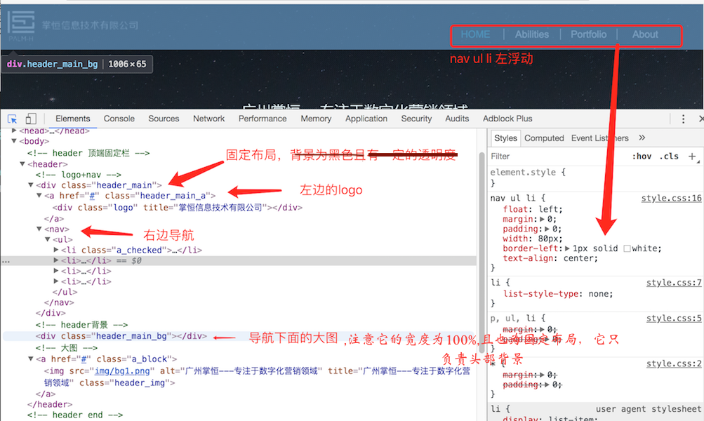
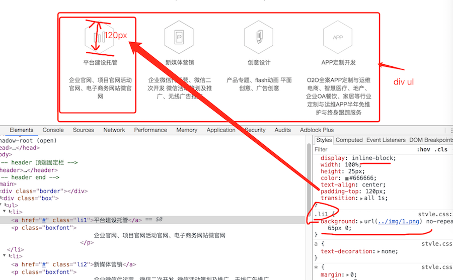
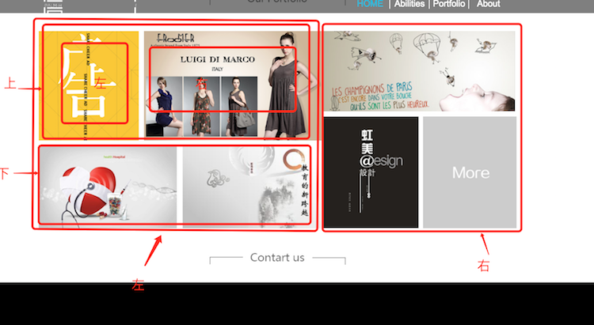
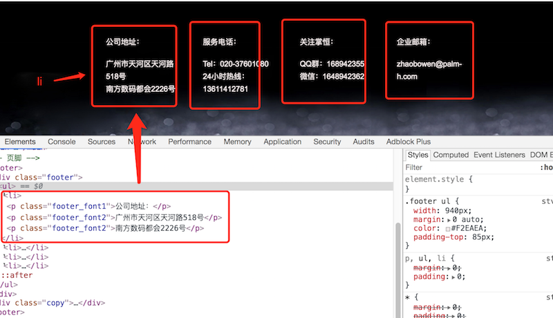
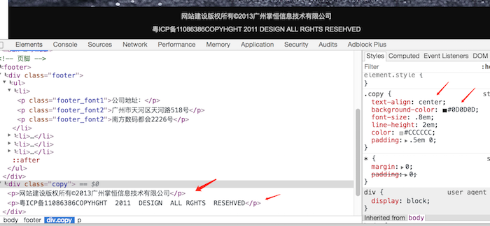

#案例分析
----
####广州掌恒分析：[源码](广州掌恒) [inex.html](广州掌恒/广州掌恒index.html)
* 头部分析： 

```
  几点说明：
  1,头部背景专们有一个div（宽度为100%）负责背景,它为固定布局，它位于header_main的下面（z-index比header_main的要低）；
  2，header_main真正意义的头部：左边为logo,右边的导航；
  3,右边为ul li组成，浮动布局。中间的线条其实为border-right;
  4,左边header_main_a高度比右边的ul要高，它采用了display：inline-block清除浮动；
  5，注意左边的logo采用了 no-repeat，如果没有no-repeat图片显示如下所示：
```


* 中间内容部份1：
 
* 中间内容部份2：
 
 
 ###页脚部份：
 
*  底部版权：
