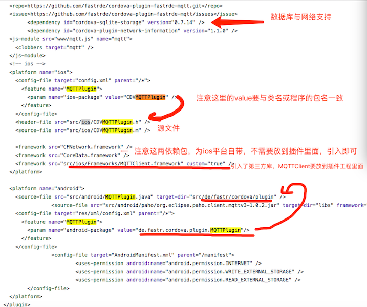

### 

* 创建插件

```
   1，在终端执行如下命令，执行完后会生成一个工程：
   plugman create --name helloPlugin --plugin_id helloPlugin --plugin_version 0.0.1
   参数说明：
       --name 后面为插件名
       --plugin_id  为插件的id
       --plugin_version 为插件的版本 
   2，cd到工程的目录，添加平台支持（执行完后，会在plugin.xml中生成对应平台的配置信息）
   plugman platform add --platform_name android //增加android平台
   plugman platform add --platform_name ios //增加ios平台
   
     _connect: function(success, error){
       cordova.exec(success, error, "MQTTPlugin", "connect", [mqtt.host, mqtt.port, mqtt.options]);
  }, 
        
   
```

* 修改插件的配置文件，[可参考](https://github.com/fastrde/cordova-plugin-fastrde-mqtt/blob/master/plugin.xml) 

 配置文件说明：
* 插件JS调用OC或Java中的方法：
	* JS调用格式示例：[对应的JS文件](https://github.com/fastrde/cordova-plugin-fastrde-mqtt/blob/master/www/mqtt.js)
	
	```
	
 _connect: function(success, error){
       cordova.exec(success, error, "MQTTPlugin", "connect", [mqtt.host, mqtt.port, mqtt.options]);
  }, 
  
  参数说明:
     success:表示调用成功后JS的回调函数
     error：表示调用失败后JS的回调函数
     "MQTTPlugin"：服务名称，这里要与plugin.xml中的feature中的name保持一致；
     "connect"：对应底层的方法名
     []:表示要传到底层的参数
  
	```
* 底层的方法声明：
  	
   ```
    //OC中方法的声明：
    - (void)connect:(CDVInvokedUrlCommand*)command;
   /*
    OC中统一用command来处理，CDVInvokedUrlCommand属性说明：
       arguments：数组，JS传过来的所有参数全部存放在这个数组里面
       callbackId：
       className：
       methodName：
   */ 
   
    
    
    //Java中方法的声明
     private void connect(final String host, final int port, final JSONObject options, final CallbackContext callbackContext){....}
     
   ```
* 底层方法实现:[OC代码](https://github.com/fastrde/cordova-plugin-fastrde-mqtt/blob/master/src/ios/CDVMQTTPlugin.m) [Java代码](https://github.com/fastrde/cordova-plugin-fastrde-mqtt/blob/master/src/android/MQTTPlugin.java)