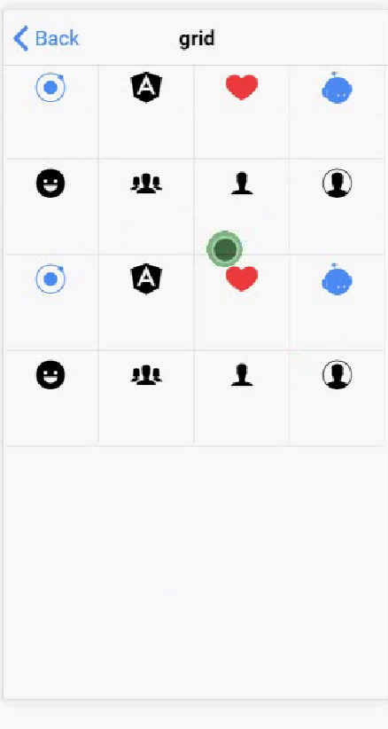

###ionic 提供的几种颜色
* light default secondary danger dark

###ionic 中的按钮，加 ion-button 属性

* [按钮使用Demo](https://ionicframework.com/docs/components/#buttons)
* [按钮的API与属性](https://ionicframework.com/docs/api/components/button/Button/)

```HTML
  <button ion-button>按钮</button>
```

###ionic中的列表
* [列表使用Demo](https://ionicframework.com/docs/components/#lists)
* [list API](https://ionicframework.com/docs/api/components/list/List/)  [item API](https://ionicframework.com/docs/api/components/item/Item/)

#####列表分类
1. 基本列表 
   
   ```HTML
   <ion-list inset>
    <ion-item *ngFor="let item of list">
      {{item}}
    </ion-item>
  </ion-list>
  
   ```
2. 分组列表 ion-item-divider
   
   ```HTML
 
    <ion-list>
    <ion-item-divider>
      宝马
    </ion-item-divider>
    <ion-item>
      宝马x1
    </ion-item>
    <ion-item>
      宝马x1
    </ion-item>

    <ion-item-divider>
      奥迪
    </ion-item-divider>
    
    <ion-item>
      奥迪x1
    </ion-item>
    <ion-item>
      奥迪x1
    </ion-item>
  </ion-list>
  
   ```
3. 列表中的图标 ion-icon
   

	item-start 属性: 开头显示  
	item-end 属性: 结尾显示
   
   ```HTML
  <ion-list> 
  <ion-item>
     <ion-icon name="leaf" item-start></ion-icon> Herbology
    <ion-icon name="rose" item-end></ion-icon> 
    </ion-item>
</ion-list>
  
   ```
4. 列表中的头像 ion-avatar
   
   ```HTML
  
  <ion-item>
<ion-avatar item-start>
 </ion-avatar>
<h2>Cher</h2>
<p>Ugh. As if.</p>
</ion-item>
  
   ```
5. 列表中的图片 ion-thumbnail
   

	item-start 属性: 开头显示  
	item-end 属性: 结尾显示
	
   ```HTML
  
    <ion-list inset>
    <ion-item>
      <ion-icon name="home" item-start></ion-icon>
      列表左右图标
      <ion-icon name="person" item-end></ion-icon>
    </ion-item>
    <ion-item>
      <ion-icon name="home" item-start></ion-icon>
      列表左右图标
      <ion-icon name="person" item-end></ion-icon>
    </ion-item>

    <ion-item>
      <ion-icon name="home" color="secondary" item-start></ion-icon>
      收藏

    </ion-item>
    <ion-item>
      <ion-icon name="person" color="danger" item-start></ion-icon>
      <p>用户</p>

    </ion-item>
    <ion-item>
      <ion-icon name="person" color="danger" item-start></ion-icon>
      <p>用户</p>

    </ion-item>
  </ion-list>

  
   ```
6. 徽章的列表 ion-badge
   
   ```HTML
  
  <ion-item>
<ion-icon name="logo-twitter" item-start></ion-icon> Followers
<ion-badge item-end>260k</ion-badge>
</ion-item>
  
   ```
7. 徽章的列表 ion-badge
   
   ```HTML
  
  
   ```
 
#ionic 中的表单
   
   
   ```HTML
  <ion-header>

  <ion-navbar>
    <ion-title>ioninput</ion-title>
  </ion-navbar>
</ion-header>
<ion-content>
  <!--<ion-list>-->
    <!--<ion-item>-->
      <!--<ion-label fixed>用户名</ion-label>-->
      <!--<ion-input type="input"></ion-input>-->
    <!--</ion-item>-->

    <!--<ion-item>-->
      <!--<ion-label fixed>密码</ion-label>-->
      <!--<ion-input type="password"></ion-input>-->
    <!--</ion-item>-->

    <!--<ion-item>-->
      <!--<ion-label>记住密码</ion-label>-->
      <!--<ion-toggle checked="false"></ion-toggle>-->
    <!--</ion-item>-->
  <!--</ion-list>-->

  <ion-list>
    <ion-item>
      <ion-input type="input" placeholder="用户名"></ion-input>
    </ion-item>

    <ion-item>
      <ion-input type="password" placeholder="密码"></ion-input>
    </ion-item>
  </ion-list>
  <button ion-button block>登录</button>
</ion-content>

  
   ```
   
#栅格系统

* [参考官方](https://ionicframework.com/docs/components/#grid) 

	与bootstrap相似，由12列构成，col-x用于设置列的宽度，如col-12表示一行中有一列，col-6表示一行有两列。


	栅格系统可以快速实现九宫格布局
九宫格：

```HTML

    <div class="list">
      <ion-row><!--每一行分为4列-->
          <!--第一行-->
          <ion-col col-3><ion-icon name="ionic" color="primary"></ion-icon></ion-col>
          <ion-col col-3><ion-icon name="logo-angular"></ion-icon></ion-col>
          <ion-col col-3><ion-icon name="heart" color="danger"></ion-icon></ion-col>
          <ion-col col-3><ion-icon name="ionitron" color="primary"></ion-icon></ion-col>

         <!--第二行-->
           <ion-col col-3><ion-icon name="happy" color="vibrant"></ion-icon></ion-col>
          <ion-col col-3><ion-icon name="people"></ion-icon></ion-col>
          <ion-col col-3><ion-icon name="person"></ion-icon></ion-col>
          <ion-col col-3><ion-icon name="contact"></ion-icon></ion-col>

         <!--第三行-->
          <ion-col col-3><ion-icon name="ionic" color="primary"></ion-icon></ion-col>
          <ion-col col-3><ion-icon name="logo-angular"></ion-icon></ion-col>
          <ion-col col-3><ion-icon name="heart" color="danger"></ion-icon></ion-col>
          <ion-col col-3><ion-icon name="ionitron" color="primary"></ion-icon></ion-col>

          <!--第四行-->
          <ion-col col-3><ion-icon name="happy" color="vibrant"></ion-icon></ion-col>
          <ion-col col-3><ion-icon name="people"></ion-icon></ion-col>
          <ion-col col-3><ion-icon name="person"></ion-icon></ion-col>
          <ion-col col-3><ion-icon name="contact"></ion-icon></ion-col>

      </ion-row>
    </div>

```	

相关css代码

```	
.list{
    ion-col{
        text-align: center;
        border:1px solid #eee;
        margin-left: -1px;
        margin-top:-1px;
        height:80px;
    }
    ion-icon{
        font-size:30px;
    }
}
```	

运行效果
