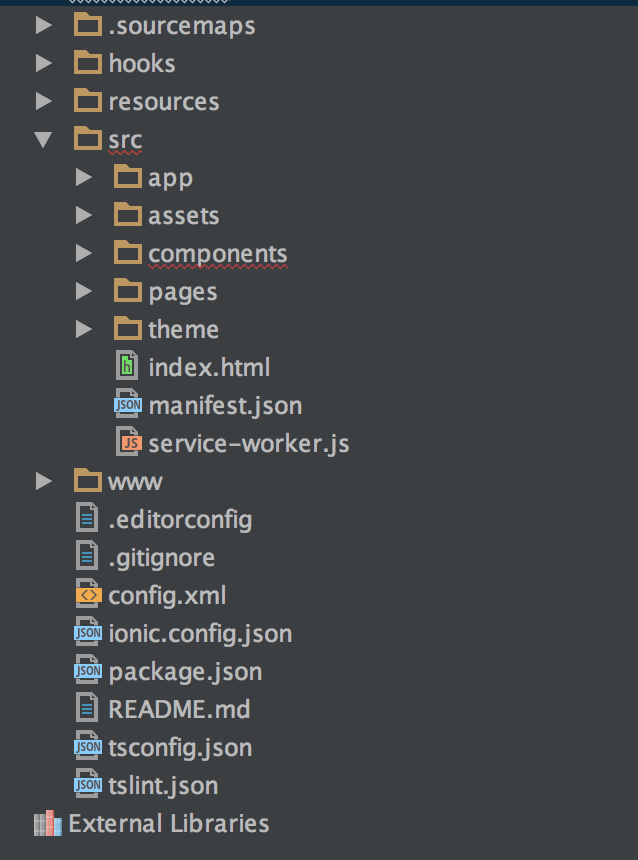
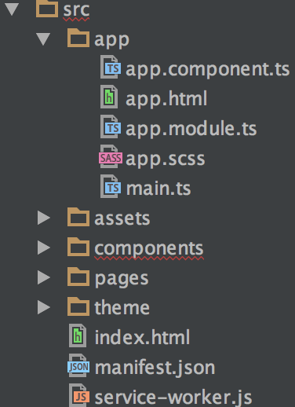
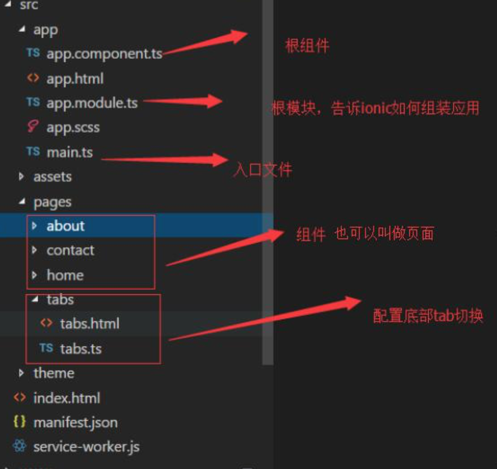
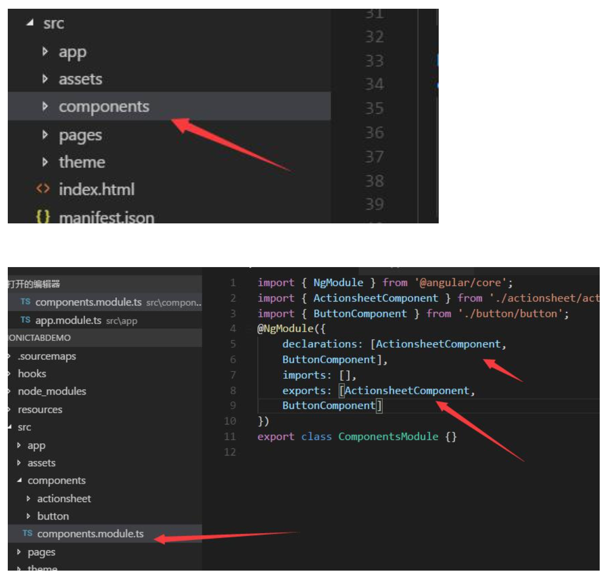
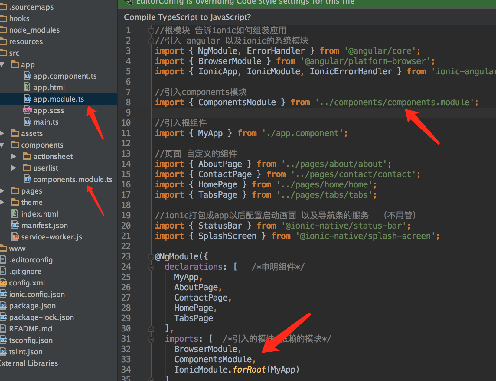
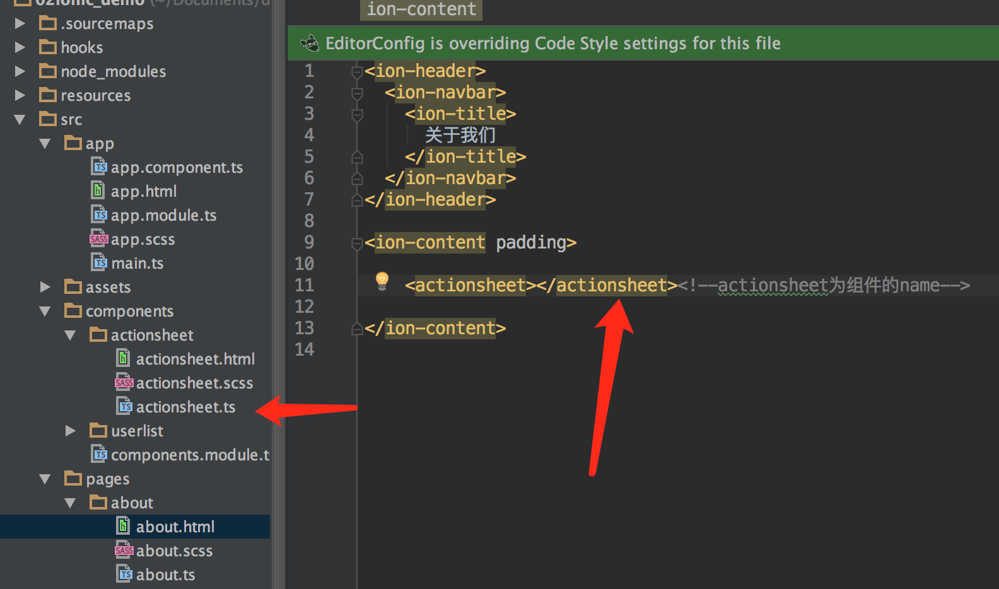
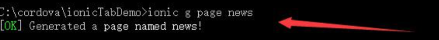
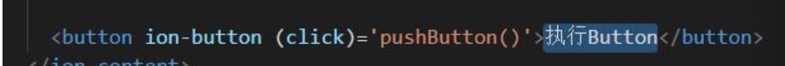
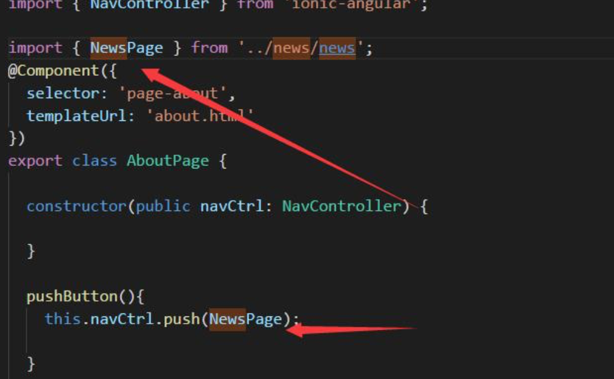

# Ionic3.x 目录结构分析


*  hooks:编译 cordova 时自定义的脚本命令，方便整合到我们的编译系统和版本控制系统中 
*  node_modules :node 各类依赖包
*  resources :android/ios 资源(更换图标和启动动画)
*  src:开发工作目录，页面、样式、脚本和图片都放在这个目录下
*  www:静态文件
*  platforms:生成 android 或者 ios 安装包路径( platforms\android\build\outputs\apk:apk 所在位置)执行 cordova platform add android 后会生成
*  plugins:插件文件夹，里面放置各种 cordova 安装的插件
*  config.xml: 打包成 app 的配置文件
*  package.json: 配置项目的元数据和管理项目所需要的依赖
*  tsconfig.json: TypeScript 项目的根目录，指定用来编译这个项目的根文件和编译选项
*  tslint.json:格式化和校验 typescript

###src目录



* app:应用根目录
* assets:资源目录(静态文件(图片，js 框架。。。)
* pages:页面文件，放置编写的页面文件，包括:html，scss，ts。
* theme:主题文件，里面有一个 scss 文件，设置主题信息。


###Ionic3.x src 下面文件分析


###app.module.ts 源代码分析

```HTML
//根模块 告诉ionic如何组装应用
//引入 angular 以及ionic的系统模块
import { NgModule, ErrorHandler } from '@angular/core';
import { BrowserModule } from '@angular/platform-browser';
import { IonicApp, IonicModule, IonicErrorHandler } from 'ionic-angular';

//引入components模块
import { ComponentsModule } from '../components/components.module';

//引入根组件
import { MyApp } from './app.component';

//页面 自定义的组件
import { AboutPage } from '../pages/about/about';
import { ContactPage } from '../pages/contact/contact';
import { HomePage } from '../pages/home/home';
import { TabsPage } from '../pages/tabs/tabs';

//ionic打包成app以后配置启动画面 以及导航条的服务  （不用管）
import { StatusBar } from '@ionic-native/status-bar';
import { SplashScreen } from '@ionic-native/splash-screen';

@NgModule({
  declarations: [   /*申明组件*/
    MyApp,
    AboutPage,
    ContactPage,
    HomePage,
    TabsPage
  ],
  imports: [  /*引入的模块 依赖的模块*/
    BrowserModule,
    ComponentsModule,
    IonicModule.forRoot(MyApp)
  ],
  bootstrap: [IonicApp],  /*启动的模块*/
  entryComponents: [   /*配置不会在模板中使用的组件*/
    MyApp,
    AboutPage,
    ContactPage,
    HomePage,
    TabsPage
  ],
  providers: [   /*配置服务*/
    StatusBar,
    SplashScreen,
    {provide: ErrorHandler, useClass: IonicErrorHandler}
  ]
})
export class AppModule {}

```

#Ionic3.x 创建组件
1. cd 到我们的项目目录
2. 通过 ionic g component 组件名称创建组件
3. 创建完成组件以后会在 src 目录下面多一个 components 的目录，这个目录里面有我 们用命令创建的所有的组件。

   

4. 如果我们要使用这些组件必须在 app.module.ts 里面注册我们的模块，注册完成后就可以在pages里面的其页面里面使用这些组件。 
   
	Page页面引用： 
   
   
#Ionic3.x 创建页面以及页面跳转
  
  
  

   
    




