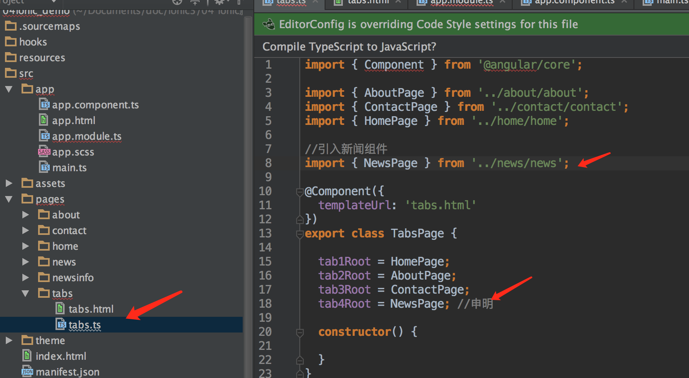
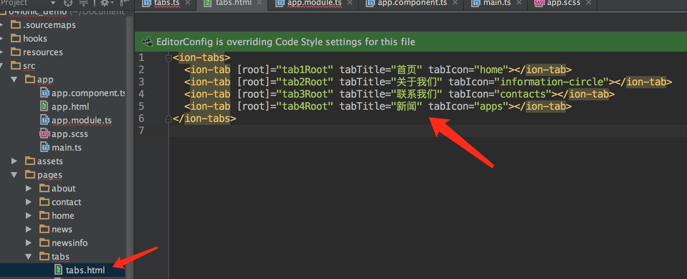
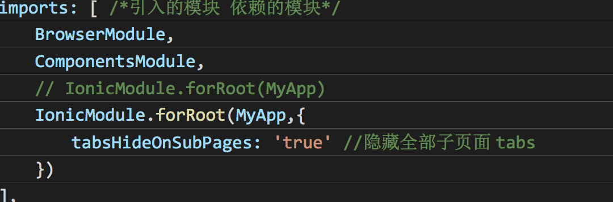
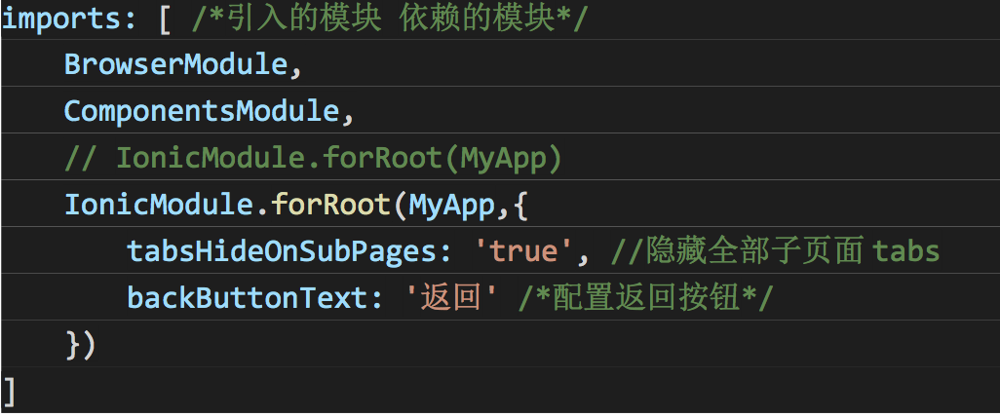

#新增 Tabs 页面
源码 04ionic_demo
1. 重新创建一个项目
  
   ```HTML
   ionic start ionicdemo02 tabs
   cd ionicdemo02
   ionic serve
   ```
2.  重新创建两个页面(组件)
   
   ```HTML
   ionic g page news
   ionic g page newsinfo
```   
3.  在 app.module.ts 引入组件，注册组件

 ```
 
 import { NgModule, ErrorHandler } from '@angular/core';
import { BrowserModule } from '@angular/platform-browser';
import { IonicApp, IonicModule, IonicErrorHandler } from 'ionic-angular';
import { MyApp } from './app.component';
import { AboutPage } from '../pages/about/about';
import { ContactPage } from '../pages/contact/contact';
import { HomePage } from '../pages/home/home';
import { TabsPage } from '../pages/tabs/tabs';
//引入新闻组件
import { NewsPage } from '../pages/news/news';
import { NewsinfoPage } from '../pages/newsinfo/newsinfo';
import { StatusBar } from '@ionic-native/status-bar';
import { SplashScreen } from '@ionic-native/splash-screen';
@NgModule({
  declarations: [
    MyApp,
    AboutPage,
    ContactPage,
    HomePage,
    TabsPage,
    NewsPage,   /*申明组件*/
    NewsinfoPage
  ],
  imports: [
    BrowserModule,
    // IonicModule.forRoot(MyApp)

    IonicModule.forRoot(MyApp,{
      tabsHideOnSubPages: 'true', //隐藏全部子页面 tabs
      backButtonText: '返回' /*配置返回按钮*/
    })
  ],
  bootstrap: [IonicApp],
  entryComponents: [
    MyApp,
    AboutPage,
    ContactPage,
    HomePage,
    TabsPage,
    NewsPage,   /*申明组件*/
    NewsinfoPage
  ],
  providers: [
    StatusBar,
    SplashScreen,
    {provide: ErrorHandler, useClass: IonicErrorHandler}
  ]
})
export class AppModule {} 
 ```

4. 在 tabs.ts 页面引入组件，配置组件
   

5. 在 tabs.html 配置底部按钮以及图标
   
   
#去掉二级页面 tabs 菜单，修改返回按钮

* 去掉二级页面的 tabs 菜单，找到 app.module.ts 修改下面代码
    

* 修改返回按钮，找到 app.module.ts 修改下面代码

  